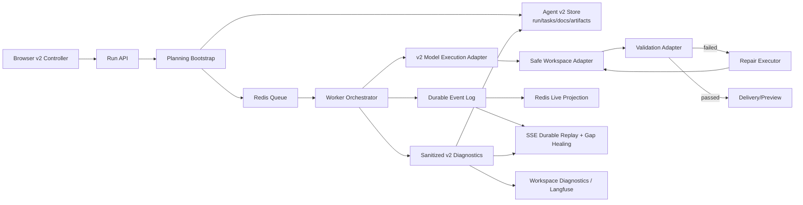

# Application Generation Agent v2 Phase 10 Preflight 设计规格

**日期：** 2026-07-10

**状态：** 独立复审通过，待用户确认

**关联审查：** `docs/superpowers/reviews/2026-07-10-application-generation-agent-v2-phase10-preflight-review.md`

## Reset and rollback invariant

1. Stop v2 workers.
2. Run the Agent v2 reset maintenance operation with confirmation token application-generation-agent-v2.
3. Start v2 workers.
4. Verify /api/agent-v2/runs/start and event replay.

Rollback: redeploy the previous code version and restore from backup if required.

## 1. 目标

在运行 Phase 10 真实端到端验收前，把 Application Generation Agent v2 从“可测试的确定性骨架”推进为安全、真实、可恢复、可诊断的唯一生产生成链，并清除仍在影响边界清晰度的旧浏览器语义、死代码和浅抽象。

本设计采用以下顺序：

1. 先修复安全边界与真实 v2 生产主链；
2. 再修复 Redis/worker/event/diagnostic 可靠性；
3. 再删除遗留代码并收敛公共 Interface；
4. 所有 preflight 门槛通过后，才进入真实 E2E。

## 2. 不可协商的约束

- Application Generation Agent v2 是唯一正式生成运行时。
- 不保留、恢复或重新引入 v1 兼容路径。
- 不增加 `PI_APP_AGENT_VERSION=v1/v2` 正式双路径或 feature flag。
- 不兼容旧 prompt、spec/plan/tasks、preview goal continuation、旧 repair 流程或旧内部 Interface。
- 不迁移旧 run/session/message/app preview goal/diagnostic 数据。
- 允许破坏式 schema reset；回滚只通过重新部署旧代码版本。
- 发现旧模块调用时，迁移调用者使用 v2 模块，不得复活旧实现。
- 已明确删除的旧 queue/event/sink/retry/bridge/runtime wrapper/message conversion 模块不得恢复。
- 本地 web/worker 从源码运行，Docker 只提供 PostgreSQL 和 Redis。
- `docker/pi-coding-web` 是远程内网部署配置，不因本地 preflight 随意修改。
- 不推送、不合并回 `vibecoding-platform`；在隔离分支等待用户确认。

## 3. 方案比较

### 方案 A：最小补丁后立即 E2E

只在 `startRun()` 中补 bootstrap，并让 deterministic core 继续写样板 HTML，随后运行 E2E。

优点是改动少，能快速得到一个表面通过的 happy path。缺点是没有真实 model generation、repair 不执行、browser 仍依赖旧 AgentEvent，路径与 build 安全问题也未解决。该结果不能代表生产 v2，因此不采用。

### 方案 B：安全与真实主链优先，随后可靠性和删除

先建立安全文件/preview/build 边界、原生 v2 model execution 与完整状态/repair 闭环；再处理 durable/live、Redis claim、worker lifecycle、diagnostic；最后删除遗留模块并统一 mirror/exports。

优点是每个阶段都有可验证的生产语义，能用 TDD 和独立提交控制风险；真实 E2E 将验收实际生产链。成本是 preflight 工作多于最小补丁，但每项都直接消除审查发现。**采用本方案。**

### 方案 C：先重写整个 store/worker/runtime

一次性重新设计 schema、queue、event、worker 和 browser。

优点是理论上可获得统一模型；缺点是风险面过大，会丢失 Phase 1 至 Phase 9 已验证的基础设施能力，也不利于用小步失败测试确定回归来源。因此不采用整体重写，只在具体 seam 无法满足契约时替换局部模块。

## 4. 目标架构

架构原则：

- PostgreSQL/SQLite durable store 是 run/task/artifact/event/diagnostic 的事实源；
- Redis queue 与 live stream 是可重建的交付机制，不能拥有不可恢复的唯一业务状态；
- worker orchestration 只依赖 v2 Interface，不导入浏览器 Agent、旧 continuation 或旧 prompt；
- model、workspace、validation、repair、preview 都有明确输入输出与故障类型；
- 所有不可信生成内容在进入文件系统、shell、preview 或日志前经过边界验证；
- 公共 Interface 表达业务语义，避免只有一层透传的 Adapter 和重复类型别名。

## 5. 设计一：安全 Workspace、Preview 与 Build 边界

### 5.1 统一路径授权

新增一个供 file、preview、quality gate、smoke gate 共用的深模块，提供：

- 规范化项目相对路径；
- 拒绝绝对路径、空段、`.`/`..`、设备路径和内部元数据名；
- 对已存在目标执行 realpath containment；
- 对新建目标查找最近存在父目录并执行 realpath containment；
- 使用 `path.relative()` 与平台 `sep` 判断边界，不硬编码 `\` 或 `/`；
- 返回已验证的 absolute path，调用者不得再次自行拼接。

内部元数据由受信任的 workspace lifecycle Adapter 管理，模型/file tool 不能直接 create/rewrite/delete。

### 5.2 Preview 授权

preview request 每次都验证：

- projectId 对应的可信项目根；
- metadata 中的 serve root 位于真实项目根内；
- 请求目标 realpath 位于真实 serve root 内；
- readiness probe origin 来自可信配置或内部 server origin，不能由任意 Host 直接决定。

readiness checker 是发布门槛，不是请求时授权的替代品。

### 5.3 Build 隔离

生成项目视为不可信输入。Phase 10 preflight 选定 **ephemeral container BuildRunner**，本地源码 worker 通过可配置的 Docker/Podman CLI 启动一次性构建容器，不复用远程部署容器，也不修改 `docker/pi-coding-web`。项目先复制进隔离 volume，构建容器不挂载仓库、服务数据目录、Docker socket 或宿主敏感路径；仅把通过路径校验的 allowlisted 输出复制回项目 artifact 区。

BuildRunner Interface 必须显式约束：

- allowlisted container engine executable、image digest 与参数，不通过 `shell: true` 拼接字符串；
- 最小环境变量，不继承服务密码、Token 或 API Key；
- 独立工作 volume、只读基础镜像、非 root 用户、capability drop、no-new-privileges、CPU/内存/PID/总时间限制；
- dependency restore 阶段可按 allowlist 开网络且强制禁用 lifecycle scripts；build 阶段关闭网络。若项目必须依赖 lifecycle script，按不受支持失败；
- stdout/stderr 截断、脱敏与 diagnostic taxonomy；
- cancel 与 shutdown deadline。

默认配置必须与 guard 一致。preflight 的验收目标是容器 runner 能成功构建受支持的静态项目；engine/image 不可用、输出越界或项目要求不允许的 lifecycle/network 能力时明确 fail closed。不得回退到宿主 shell。远程部署如何提供隔离 build service 属于后续独立部署设计，不能通过挂载 Docker socket 偷渡到本次远程配置。

## 6. 设计二：真实 v2 Run 创建与 Planning Bootstrap

`startRun()` 使用 **durable transaction + outbox**。单一数据库事务原子写入：run、完整 planning bootstrap、两个 durable events，以及 Redis queue/live projection 的 dispatch intents。事务提交前不接触 Redis，因此任何 create/bootstrap/event 中途失败都会整体回滚，不会留下空 task graph。

事务内顺序定义为：

1. 验证并规范化 v2 request；
2. 在 durable store 创建 run；
3. 用唯一 planning bootstrap 生成并持久化 capability decision、spec、plan、tasks 和初始 phase；
4. 依次追加两个独立事件：`agent_v2.run_created` 和 `agent_v2.planning_ready`；
5. 写 queue dispatch intent 和上述事件的 live projection intents。

事务提交后，dispatcher 以 outbox row lease + CAS 取得投递权，将 runId 幂等写入 Redis queue，并按 durable seq 投影 live events；成功后标记对应 intent delivered。API 可同步触发一次 dispatch，但 Redis 失败不反转 durable start 成功，maintenance 会扫描未 delivered 或过期 lease 的 intents 并重试。

runId + bootstrap version、runId + queue destination、runId + event seq 分别构成 bootstrap、queue 和 live projection 的唯一幂等键。重复事务必须返回已有一致结果或冲突，不能追加重复 task/document。queue 使用 runId 去重；dispatcher 崩溃前后重复投递仍只产生一个可 claim 工作项。maintenance 的扫描条件、lease owner、lease expiry、attempt 和 lastError 都持久化在 outbox。必须覆盖 create 后、bootstrap 中、events 后、事务 commit 后/Redis 前、Redis 成功/ack 丢失和 delivered CAS 前的 crash-point 测试。

## 7. 设计三：v2 原生 Model Execution

### 7.1 Interface

生产 worker 使用一个 v2 原生 `ModelExecution` 边界，输入至少包含：

- runId、objective、model 与受支持 provider 配置引用；
- 当前 v2 context packet；
- active task、依赖、acceptance criteria；
- 已授权 attachments/projectFiles 的 workspace 引用；
- artifact index、open diagnostics 和 required rereads；
- cancellation/deadline signal。

输出是受 schema 验证的 v2 action/result，而不是旧 AgentEvent：

- document update；
- workspace file change set；
- task outcome；
- diagnostic；
- usage/provider metadata 的脱敏摘要。

### 7.2 Production 与 Test 分离

- production composition 必须注入真实 provider-backed Adapter；
- unit tests 注入 deterministic fake；
- production-path boundary test 禁止注入测试 `SequencedExecution` 来证明真实链；
- worker 不导入 browser `Agent`、旧 coding prompt、旧 context orchestrator 或 remote resume。

Provider 错误映射为稳定 v2 taxonomy：invalid request、auth/config、rate limit、transient transport、timeout、cancel、malformed output、policy rejection。只有明确可重试的类型才进入有上限的 v2 task retry/repair 策略；不恢复旧 retry controller。

## 8. 设计四：状态机、Artifact 与 Repair 闭环

### 8.1 显式状态转换

建立集中 transition matrix，至少约束：

- run status 与 phase；
- task ready/running/succeeded/failed/blocked/cancelled；
- artifact `not_started/pending/passed/failed/accepted`；
- validation attempt 与 repair attempt。

所有转换通过 store CAS，要求 expected status/phase/attempt。非法转换返回 typed conflict 并产生 sanitized diagnostic。

### 8.2 Phase 投影

持久化的 run phase 是唯一事实源。每次 task transition 在同一数据库事务中 CAS task 并更新 run phase，同时追加对应 durable event/outbox；读取路径不临时从 task graph 推导另一个 phase。独立 invariant checker 可由 task graph 验证 phase 一致性并产生 diagnostic，但不能静默改写。阶段为 intake → planning → implementation → validation → repair → delivery → terminal。UI 只投影持久化 phase，不得把长时间运行的 run 固定显示为 intake。

Artifact 状态沿用并固定为 `not_started → pending → passed/failed → accepted`。repair 成功产生新 revision 时，受影响 artifact 从 `failed` 回到 `pending`；只有最新 revision 的 validation passed 才能进入 `passed`，delivery 接纳后进入 `accepted`。不引入同义的 `valid/invalid` 枚举。

### 8.3 Repair 执行

validation failure 创建不可变 validation attempt 和关联 diagnostic；repair planner 生成结构化 repair action；repair executor 通过安全 workspace/model Adapter 应用变更，并记录：

- 输入 diagnostic/validation/artifact；
- 变更文件与新 artifact revision；
- 执行结果与失败 taxonomy；
- 下一次 validation attempt。

只有成功产生实际变更才允许 revalidate。无变更、重复同一修复或超过上限时进入明确 failed/blocked terminal，不无限循环。

## 9. 设计五：Durable Event、Live Projection 与 SSE

durable event log 是唯一事实源，sequence 由 store 分配。Redis live stream 只做低延迟 projection。所有业务事件与 live projection 都必须沿用第 6 节选定的 durable transaction + outbox，不提供 best-effort 直发分支：业务状态、durable event 和 projection intent 在同一数据库事务中提交，dispatcher 再按 outbox lease/CAS 幂等投影到 Redis。

该实现必须同时具备：

- publish failure 不导致已完成业务事务对 API/worker 伪装失败；
- maintenance 能从 durable sequence 重建 live projection；
- SSE 在 live seq 跳跃、读取超时或周期检查时回 durable store 补洞；
- terminal event 必须能仅凭 durable replay 到达客户端；
- 重复投影按 runId + seq 幂等；
- 事件因果顺序由 durable seq 决定，不由 Redis 到达顺序决定。

SSE gap healing 是 outbox 之外的额外防线，用于覆盖投影延迟、Redis retention、网络中断和客户端跨节点重连；不得以 gap healing 取代 outbox 投递与维护。

SSE 输出增加标准 `id: <seq>`，同时保留自有 `afterSeq` 客户端。服务端接受并验证 `Last-Event-ID`，两者冲突时采用明确定义的优先级。

## 10. 设计六：统一 Sanitized Diagnostics

所有 v2 diagnostic 在创建边界先规范化、分类和脱敏。Agent v2 diagnostic row 是 canonical record；该 row 与需要的 run-event/workspace/Langfuse projection intents 在同一数据库事务中写入。事务失败则业务动作与 diagnostic 一起回滚；事务提交后，各非核心 sink 由 outbox dispatcher 独立重试，sink 失败不能反转业务状态或阻塞 worker 终止。

同一 sanitized canonical event 可投影到：

- Agent v2 diagnostic store；
- durable run event（需要用户可见时）；
- Workspace diagnostic log；
- Langfuse exporter；
- diagnostic archive。

Agent v2 store 与关联 durable run event 属于核心 durable transaction。Workspace diagnostic、Langfuse 和归档属于可重建/可重试 projection，各自维护 delivered/lease/attempt/lastError；一个 sink 的失败不阻塞其他 sink。归档若直接从 canonical store 生成，则不额外复制 raw payload。超过重试上限后保留 dead-letter intent 并写不含原始 secret 的本地 lifecycle diagnostic。

脱敏覆盖 key 名、header/cookie、URL credential/query、嵌套对象、数组、Error/cause、stdout/stderr、provider payload 和自由文本中的常见 secret pattern。原始 secret 不以“先落库后导出时再脱敏”的方式保存。

taxonomy 至少区分 planning、model、task_graph、artifact、validation、repair、workspace_security、queue、lease、cancel、event_projection、worker_lifecycle、preview、build 和 config。maintenance 错误不得吞掉。

Langfuse flush 必须有 deadline/AbortSignal，并等待已存在的 in-flight batch；失败只产生安全本地 diagnostic，不能阻止 run/worker 正确终止。

## 11. 设计七：Redis Queue 与 Worker 生命周期

### 11.1 Claim 隔离

每个并发 blocking claim 使用独立连接或可证明互不干扰的连接池 slot。command、claim、live read 连接彼此隔离。claim timeout 只能中断自己的 pending operation。

claim token recovery 必须覆盖：

- blocking pop 响应丢失；
- claim record 已写但客户端超时；
- reconnect 后按 workerId/token 恢复；
- 非 owner 无法 complete/requeue/renew。

### 11.2 Heartbeat 与 Cancel

heartbeat/cancel poll 使用串行 async loop 或防重入 guard。Redis reject 被映射为 typed lease-uncertain 状态：停止产生新副作用、尝试确认 ownership，并在 deadline 后受控 interrupt。不得让 interval Promise 形成 unhandled rejection。

cancel key 的 TTL、prune 和 terminal cleanup 使用真实 Redis 测试验证；cancel 不能依赖旧 repair/retry 模块。

### 11.3 Reclaim

避免“删除唯一 claim 后再尝试 enqueue”。可选设计：

- Redis 原子脚本把 expired active claim 移回 ready queue；或
- 先建立 durable recovery intent，再原子迁移 queue 状态，并由 maintenance 幂等完成。

DB 与 Redis 不可能形成单事务时，以 durable run 状态和可重复 reconciliation 保证最终恢复。任何失败都写 taxonomy diagnostic。

### 11.4 Shutdown

worker stop 总 deadline 覆盖：停止新 claim、取消 blocking reads、等待 active work、interrupt/requeue、queue/event bus close、diagnostic/Langfuse drain、store close。每个子步骤都必须受剩余 deadline 控制，超时后进入可观测的强制退出路径。

## 12. 设计八：Browser v2 边界

Browser 只理解 v2 API DTO 与 v2 event projection，不把 payload cast 为旧 `AgentEvent`。新 controller 负责：

- start/cancel/status；
- durable replay + live SSE 去重；
- run/task/artifact/validation/diagnostic 的 UI projection；
- reconnect 后从 lastSeq 恢复；
- terminal 状态与 preview link 更新。

objective、attachments、projectFiles 作为新的 v2 run request 输入；旧消息历史只用于当前 UI 展示，不转换为旧 continuation。删除顺序为：先用 contract tests 固定 v2 UI 行为，再迁移 bootstrap 调用者，最后删除 remote resume、旧 capability planner/context/prompt 依赖。不能保留正式双路径。

## 13. 设计九：Config、Readiness、Exports 与 Mirrors

### 13.1 Config 与 Readiness

- 未设置变量才使用默认值；显式非法枚举、整数、布尔、URL 必须 fail fast；
- 错误消息只报告变量名与期望格式，不回显 secret value；
- Web 与 worker 启动/readiness 显式探测 PostgreSQL、Redis command、queue 与 event bus；
- 本地 preflight 通过源码配置验证，不以修改远程 Compose healthcheck 解决。

### 13.2 Public Exports

删除公开方法或别名前，先建立 public-surface snapshot/deny test，确认仓库内外约束。`AgentV2RunEventLog.readLive`、`getReadyAgentV2TaskIds` 与 store alias 均按迁移任务处理，不作为无风险死代码直接删除。

### 13.3 Generated Mirrors

Phase 10 必须选择并执行一个明确策略：

1. 保留 `src` JS/map：建立唯一生成命令和 CI audit，TS 是 source of truth；或
2. 停止提交 `src` JS/map：所有运行、测试和 package exports 统一指向 TS 或 `dist`。

在策略提交前，任何 TS 修改都必须同步当前 mirror，且 source map 的 `sourcesContent` 必须与 TS 一致。`node-service-runtime.ts` 作为死模块整体删除，不为它补一套无用 mirror。

## 14. 删除策略

删除采用三层门槛：

1. **高置信度死代码：** CodeGraph 无 caller、全文无引用、无 export、无行为测试；先加必要 deny/boundary test，再删除源与 mirrors；
2. **公开但无仓库 caller：** 先迁移/收窄 public export，验证无消费者，再删除；
3. **仍有生产 caller 的旧 seam：** 先实现 v2 替代、迁移所有调用者、增加禁止旧 import 的测试，最后删除。

每个删除提交附带：CodeGraph impact、`rg` 引用结果、export diff、聚焦测试和 mirror audit。禁止为减小 diff 而留下 compatibility wrapper。

## 15. TDD 与 Subagent-Driven 实施规则

详细实施计划在本规格审阅通过后编写。实施时遵循：

- 每个行为修复先写能证明生产语义的失败测试；
- 高风险安全/删除先加边界测试；
- 优先真实 Adapter 测试，fake 只用于可控单元边界；
- 子任务按写入范围拆分，避免多个 subagent 同时修改核心 store/types/barrel；
- 每个子任务执行“失败测试 → 最小实现/删除 → 聚焦测试 → spec review → code quality review”；
- reviewer 发现 Blocker/Important 时回到同一任务修复并复审；
- 每个重要任务创建本地提交，不推送、不合并；
- subagent 不得还原他人修改，不得恢复任何旧模块。

建议提交序列按架构 seam 划分，而非按文件数量划分：

1. workspace/preview/path safety；
2. build isolation contract；
3. startRun/bootstrap transaction；
4. real v2 model execution；
5. state/artifact/repair loop；
6. diagnostics redaction/fan-out；
7. durable/live/SSE；
8. queue/worker lifecycle；
9. browser v2 migration；
10. config/readiness；
11. dead code/public exports/mirror cleanup；
12. aggregate verification fixes。

## 16. 验证门槛

进入真实 E2E 前必须全部满足：

- web-workspace 全量测试通过；
- pi-coding-web 全量测试通过；
- TypeScript checks 通过；
- worker build 通过；
- 前端 production build 通过；
- 使用 Docker 本地 Redis 运行真实 Redis integration tests，不能跳过；
- 本地 PostgreSQL/Redis dependency readiness 测试通过；
- CodeGraph sync/status 显示索引最新；
- `git diff --check` 通过；
- mirror generation/audit 通过；
- secrets/redaction 路径测试通过，输出不含真实凭据；
- 工作树只包含计划内修改；
- 独立 reviewer 复审无 Blocker/Important。

测试或构建失败时，先进行系统性根因诊断，不通过放宽断言、增加兼容路径或跳过真实 Redis 测试绕过门槛。

## 17. Preflight 完成定义

Phase 10 preflight 只有在以下结果同时成立时才完成：

1. production run 从 API 到 worker 使用唯一 v2 planning/model/task/artifact/validation/repair/delivery 链；
2. 小型静态应用由真实 model Adapter 生成，不是 deterministic 样板；
3. 路径、preview、build 对不可信生成内容 fail closed；
4. Redis/worker/event 故障可恢复且有真实 Adapter 证据；
5. diagnostics 全链路先脱敏再持久化/导出；
6. browser 不再依赖旧 AgentEvent/continuation/planner 主链；
7. 删除清单完成，禁止模块仍保持缺失，mirrors/exports 一致；
8. 第 16 节全部验证通过。

满足后才编写并执行真实 E2E 验收脚本，依次验证本地基础设施、源码 web/worker、cutover rehearsal、真实模型生成、task/artifact/build/preview、repair/revalidate、worker crash/reclaim、cancel 与 SSE replay，最后形成 Phase 10 E2E 报告。

## 18. 非目标

- 本规格阶段不修改生产代码，不运行真实 E2E；
- 不设计 v1 数据迁移、双运行时切换或向后兼容；
- 不以恢复旧模块作为临时过渡；
- 不为本地运行随意改动远程部署配置；
- 不在用户确认前推送、合并或进入真实 E2E；
- 不在本规格未审阅前生成逐文件、逐命令的最终实施计划。
